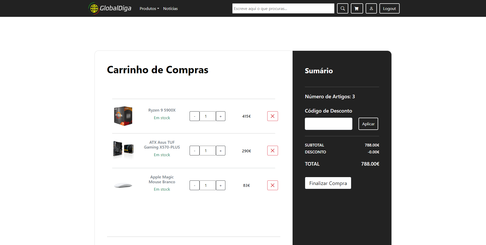
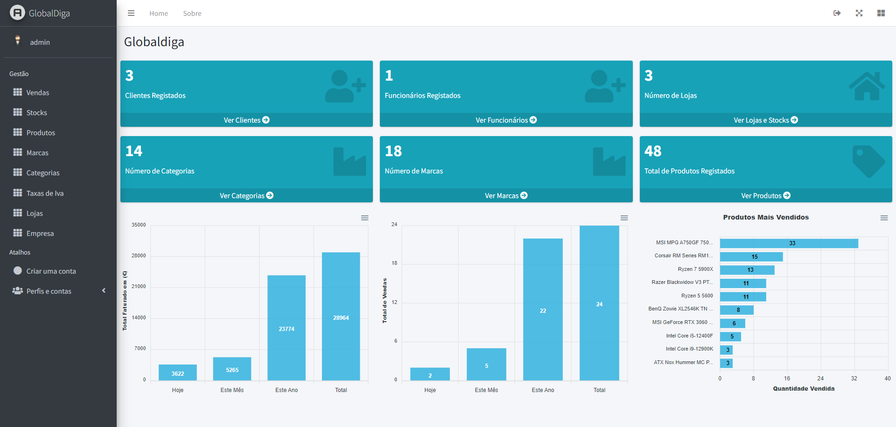

<!-- Header -->

<h1>

   GlobalDiga
</h1>
Online Tech Store.
 
<a href="#about-the-project">Summary</a> •
<a href="https://github.com/RFCarreira33/PSI_PLSI_22-23/blob/main/resources/about.md">About The Project</a> •
  <a href="https://github.com/RFCarreira33/PSI_PLSI_22-23/blob/main/resources/installation.md">Installation</a> • <a href="https://github.com/RFCarreira33/PSI_AMSI_22-23">Mobile</a> 

<!--end Header -->

## Summary

GlobalDiga is our final project of the [PSI](https://www.ipleiria.pt/curso/tesp-de-programacao-de-sistemas-de-informacao/) course, which also has a [mobile component](https://github.com/RFCarreira33/PSI_AMSI_22-23), and it is our take on a online tech store, you can read more about the details [here](https://github.com/RFCarreira33/PSI_PLSI_22-23/blob/main/resources/about.md).

## Examples

Website Main page

Website Cart page

Website Backend page

